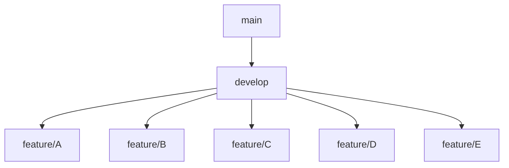

Hiểu rồi ✅. Ý bạn là muốn một **file README.md hoàn chỉnh** bao gồm:

- Giới thiệu dự án (dataset, mục tiêu, ứng dụng)
- Cấu trúc thư mục dự án
- Công cụ sử dụng
- Hướng dẫn cài đặt, chạy project
- Hướng dẫn Git workflow (main → develop → feature/nhánh thành viên)
- Phân công công việc

Mình sẽ viết bản **chuẩn chuyên nghiệp**, bạn chỉ cần copy nguyên vào file `README.md`.

---

# 📑 README.md (Bản hoàn chỉnh)

```markdown
# Sleep Health Checker 💤

## 📌 Giới thiệu

Dự án **Sleep Health Checker** được xây dựng dựa trên bộ dữ liệu  
[Sleep Health and Lifestyle Dataset](https://www.kaggle.com/datasets/uom190346a/sleep-health-and-lifestyle-dataset).

Bộ dữ liệu bao gồm các thông tin về:

- Giới tính, tuổi, nghề nghiệp
- Thời gian ngủ, chất lượng giấc ngủ
- Mức độ hoạt động thể chất, stress
- BMI, huyết áp, nhịp tim
- Tình trạng rối loạn giấc ngủ (Insomnia, Apnea, None)

### 🎯 Mục tiêu

- Phân tích và trực quan hóa dữ liệu sức khỏe – lối sống.
- Xác định các yếu tố ảnh hưởng đến chất lượng giấc ngủ.
- Xây dựng mô hình học máy để dự đoán rối loạn giấc ngủ.
- Phát triển ứng dụng Flask hỗ trợ chăm sóc sức khỏe cá nhân.

---

## 📂 Cấu trúc thư mục
```

sleep-health-checker/
│
├── data/ # Dữ liệu
│ ├── raw/ # Dữ liệu gốc (không chỉnh sửa)
│ ├── processed/ # Dữ liệu đã xử lý
│ └── external/ # Dữ liệu bổ sung (nếu có)
│
├── notebooks/ # Notebook EDA
│ ├── EDA_R/ # EDA bằng R
│ └── EDA_Python/ # EDA bằng Python
│
├── src/ # Code chính
│ ├── preprocessing/ # Tiền xử lý dữ liệu
│ ├── visualization/ # Trực quan hóa dữ liệu
│ ├── modeling/ # Huấn luyện mô hình ML
│ │ ├── R/
│ │ └── python/
│ ├── model_testing/ # Đánh giá mô hình
│ ├── backend/ # Flask API
│ │ ├── routes/
│ │ ├── models/
│ │ └── utils/
│ └── frontend/ # Giao diện web (HTML, CSS, JS)
│ ├── static/
│ │ ├── css/
│ │ ├── js/
│ │ └── img/
│ └── templates/
│
├── reports/ # Báo cáo & slide
│ ├── paper/
│ └── slides/
│
├── tests/ # Unit tests
│
├── .gitignore # File bỏ qua khi push Git
├── README.md # File hướng dẫn (bạn đang đọc)
├── PROJECT_STRUCTURE.txt # Giải thích ý nghĩa từng folder
├── requirements.txt # Thư viện Python
└── environment.yml # Môi trường Conda (nếu dùng)

````

---

## 🛠️ Công cụ sử dụng
- **R**: tiền xử lý, phân tích, trực quan hóa dữ liệu.
- **Python (scikit-learn, pandas, matplotlib, seaborn)**: học máy.
- **Flask**: xây dựng ứng dụng web.
- **HTML, CSS, JS**: giao diện người dùng.
- **Git & GitHub**: quản lý mã nguồn và cộng tác nhóm.

---

## 🚀 Cài đặt và chạy dự án

1. Clone repo về máy:
```bash
git clone https://github.com/<your-username>/sleep-health-checker.git
cd sleep-health-checker
````

2. Tạo môi trường Python và cài thư viện:

```bash
pip install -r requirements.txt
```

3. Chạy Flask app:

```bash
cd src/backend
python app.py
```

---

## 🌳 Git Workflow (main → develop → feature)

### Cấu trúc nhánh

- **main** → chứa phiên bản ổn định (release).
- **develop** → nhánh phát triển chung.
- **feature/<ten-thanh-vien>** → nhánh cá nhân để code nhiệm vụ riêng.



---

### Các bước làm việc

#### 1. Lấy nhánh develop mới nhất

```bash
git checkout develop
git pull origin develop
```

#### 2. Tạo nhánh cá nhân

Ví dụ: thành viên An tạo nhánh `feature/an`:

```bash
git checkout -b feature/an
```

#### 3. Commit code

```bash
git add .
git commit -m "An: thêm code EDA"
```

#### 4. Push nhánh cá nhân

```bash
git push origin feature/an
```

#### 5. Tạo Pull Request (PR)

- Lên GitHub → tạo **PR từ `feature/an` vào `develop`**.
- Nhóm trưởng review → nếu OK thì merge.

#### 6. Merge vào `main`

- Chỉ nhóm trưởng merge `develop` → `main` khi có bản ổn định.

---

## 📅 Quy định nhóm

- Không commit trực tiếp vào `main`.
- Trước khi code: luôn `git pull origin develop`.
- Commit message rõ ràng, ví dụ:

  - `"B: clean dữ liệu raw"`
  - `"C: vẽ heatmap stress vs sleep"`

- Mỗi người chịu trách nhiệm **1 module chính** (data, EDA, viz, ML, report).

---

## ✅ Phân công công việc

- **A**: Tiền xử lý dữ liệu.
- **B**: Thống kê mô tả & EDA.
- **C**: Trực quan hóa dữ liệu.
- **D**: Mô hình học máy.
- **E**: Báo cáo & slide thuyết trình.

---
