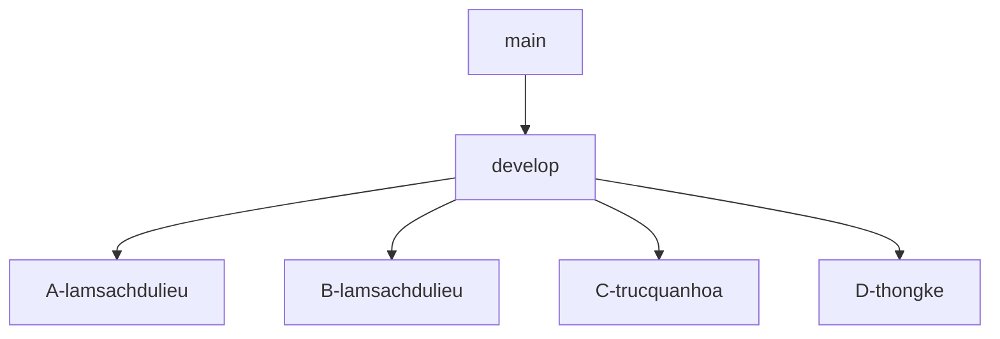

# 📊 Phân tích Sức khỏe Giấc ngủ & Lối sống - Đồ án Khoa học Dữ liệu

---

## 🚀 Giới thiệu dự án

Dự án này tập trung vào việc phân tích và trực quan hóa bộ dữ liệu **sức khỏe giấc ngủ và lối sống** bằng ngôn ngữ **R**.  
Mục tiêu chính:

- Khám phá các yếu tố ảnh hưởng đến chất lượng giấc ngủ.
- Xây dựng một quy trình làm việc nhóm hiệu quả, tuân thủ các chuẩn mực của ngành.

---

## 📂 Cấu trúc thư mục dự án

```text
sleep-health-checker/
├── data/                         # Chứa dữ liệu
│   ├── raw/                      # Dữ liệu gốc do thầy cung cấp
│   │   └── Sleep_health_and_lifestyle_dataset.csv
│   ├── processed/                # Dữ liệu sau khi tiền xử lý
│   │   └── sleep_data_clean.csv
│   └── external/                 # (Nếu có) dữ liệu bổ sung từ nguồn ngoài
│
├── notebooks/                    # Thống kê dữ liệu
│   └── 01_data_overview.Rmd      # Tổng quan dữ liệu, summary ban đầu
│
├── reports/                      # Báo cáo cuối cùng và slide thuyết trình
│
├── src/                          # Code xử lý và phân tích
│   ├── preprocessing/            # Tiền xử lý dữ liệu
│   │   └── clean_data.R
│   ├── analysis/                 # Phân tích mối liên hệ giữa các biến
│   │   └── correlation_analysis.py
│   ├── visualization/            # Trực quan hóa dữ liệu
│   │   ├── plot_boxplot.R
│   │   ├── plot_heatmap_correlation.R
│   │   └── plot_sleep_duration.R
│   ├── modeling/                 # Chủ đề nâng cao (machine learning / clustering)
│   └── model_testing/            # Đánh giá mô hình nâng cao
│
└── README.md                     # Hướng dẫn dự án
```

## 🌳 Cấu trúc nhánh Git

Chúng ta sẽ tuân thủ mô hình **Git Flow đơn giản** để quản lý source code một cách hiệu quả:

- **main**: Ổn định, chỉ chứa code đã hoàn thiện và kiểm thử.
- **develop**: Nhánh phát triển chung, nơi tích hợp các tính năng từ nhánh cá nhân.
- **feature/...**: Nhánh cá nhân, mỗi người làm việc trên một nhánh riêng.



---

## 🛠️ Quy trình làm việc (Workflow)

Mọi thành viên cần tuân thủ nghiêm ngặt quy trình 6 bước sau:

### 1️⃣ Bước 1: Clone dự án về máy

```bash
# Tạo folder đồ án trên máy tính (ví dụ: uneti-projects)
git init
git clone https://github.com/nguyendat6625/uneti-ds-project1-sleep-health.git
cd uneti-ds-project1-sleep-health
```

### 2️⃣ Bước 2: Tạo nhánh làm việc cá nhân

```bash
# Luôn cập nhật develop mới nhất trước khi tạo nhánh mới
git checkout develop
git pull origin develop

# Tạo và chuyển sang nhánh cá nhân
# Cú pháp: feature/<ten-thanh-vien>-<nhiem-vu>
#Ví dụ:
git checkout -b <name>-<nhiemvu>
git pull origin develop
git push origin <name>-<nhiemvu>
```

### 3️⃣ Bước 3: Làm việc và Commit

Quy tắc vàng khi commit: Mỗi commit phải có **prefix** để thể hiện mục đích.

- `feat`: Thêm một tính năng mới (ví dụ: biểu đồ mới).
- `fix`: Sửa một lỗi đã tồn tại.
- `docs`: Cập nhật tài liệu (như file README).
- `refactor`: Tối ưu code mà không thay đổi chức năng.
- `test`: Thêm hoặc sửa các bài test.

Ví dụ một commit đúng chuẩn:

```bash
git add .
git commit -m "feat: Thêm biểu đồ histogram cho Sleep Duration"
```

### 4️⃣ Bước 4: Push code lên Github

```bash
# Push nhánh cá nhân của bạn lên repository
#Ví dụ:
git push origin <name>-<nhiemvu>
```

### 5️⃣ Bước 5: Tạo Pull Request (PR) để review code

- Khi hoàn thành nhiệm vụ, hãy truy cập GitHub và tạo **Pull Request (PR)** từ nhánh `feature/...` của bạn vào nhánh `develop`.
- Tag ít nhất **một thành viên khác** vào để review code.

Người review có trách nhiệm:

- Kiểm tra logic và lỗi tiềm ẩn.
- Chạy thử code trên máy của mình.
- Để lại bình luận góp ý.

### 6️⃣ Bước 6: Merge vào develop

- **Chỉ Nhóm trưởng** mới có quyền merge PR vào `develop` sau khi đã được review và không còn xung đột.
- Sau khi merge, các thành viên khác cần pull `develop` về máy để đồng bộ.

---

## 🔄 Quy tắc đồng bộ & Tránh xung đột

⚠️ **TUYỆT ĐỐI KHÔNG** commit trực tiếp lên `develop` hay `main`.
Mọi thay đổi đều phải qua **Pull Request**.

Luôn cập nhật develop trước khi bắt đầu code:

```bash
git checkout develop
git pull origin develop # Lấy code mới nhất về
git checkout <nhanh-cua-ban>
git merge develop # Đồng bộ code mới vào nhánh của bạn
```

- Giải quyết xung đột (conflict) tại **nhánh cá nhân** của bạn.
- Commit thường xuyên, push đều đặn.
- Đừng để một commit chứa quá nhiều thay đổi.
